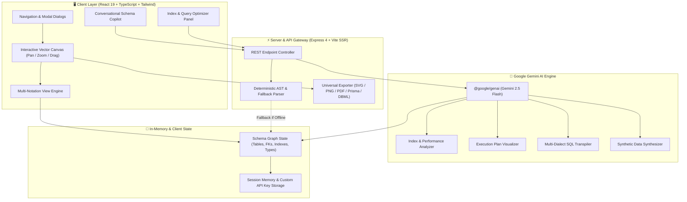

<div align="center">

# 🗄️ RelateX

### Enterprise AI Database Schema Visualizer, ERD Architect & Index Optimizer

[](LICENSE)
[](https://www.typescriptlang.org/)
[](https://react.dev/)
[](https://vitejs.dev/)
[](https://tailwindcss.com/)
[](https://ai.google.dev/)
[](https://expressjs.com/)

<p align="center">
  <b>Transform raw SQL DDL into interactive, publication-ready Entity Relationship Diagrams across 5 industry notations with real-time AI index recommendations, visual query execution plan breakdowns, conversational schema migrations, and synthetic mock data generation.</b>
</p>

[Key Features](#-key-features) • [Architecture](#-system-architecture) • [Flowchart](#-data-flow--pipeline) • [ERD Notations](#-supported-erd-notations) • [Getting Started](#-getting-started) • [API Reference](#-api-endpoints) • [Export Formats](#-export-capabilities)

---

</div>

## 🌟 Overview

**RelateX** is an all-in-one database modeling and intelligence platform designed for database administrators, software architects, and backend engineers. It bridges the gap between raw SQL DDL and deep architectural understanding by providing instant multi-notation visual layouts, intelligent index performance analysis, query plan bottlenecks inspection, and multi-dialect schema conversions.

Whether you are designing a high-throughput microservice database, refactoring legacy schemas, or explaining complex query plans to teammates, RelateX gives you crystal-clear insights and actionable optimization recommendations powered by Google Gemini AI and deterministic fallback heuristics.

---

## 🏗️ System Architecture



---

## 🔄 Data Flow & Pipeline

```mermaid
flowchart TD
    A([Input: SQL DDL / Natural Language / Sample Schema]) --> B[Client Ingestion & State Manager]
    
    B --> C{Custom Gemini Key or Default Env?}
    C -->|Provided / Online| D[Google Gemini API Pipeline]
    C -->|Fallback / Offline| E[Local Deterministic Parser Engine]

    D --> F[Structured Schema AST Graph Model]
    E --> F

    F --> G[Relational Linker & Constraint Resolver]
    
    G --> H[Interactive Canvas Renderer]
    
    subgraph Multi_Notation_Engine [Multi-Notation Adapter]
        H --> N1["Crow's Foot (IE Standard)"]
        H --> N2["Peter Chen Notation"]
        H --> N3["UML Class / IDEF1X"]
        H --> N4["Bachman Data Structure Diagram"]
        H --> N5["Star / Kimball Dimensional Schema"]
    end

    Multi_Notation_Engine --> I[User Workspace Actions]

    subgraph Action_Pipelines [Advanced Tooling Suites]
        I --> P1[AI Index & Normalization Optimizer]
        I --> P2[Visual Query Execution Plan Explainer]
        I --> P3[Natural Language Schema Copilot]
        I --> P4[Synthetic Mock Data Generator (SQL/JSON)]
        I --> P5[Multi-Dialect Converter (PG, MySQL, SQLite, Oracle, Snowflake)]
        I --> P6[Universal Exporter (SVG, PNG, PDF, DBML, PlantUML, Prisma)]
    end
```

---

## ✨ Key Features

### 1. 📐 5 Industry-Standard ERD Notations
Switch between 5 standard database modeling paradigms in a single click without re-parsing your schema:
- **Crow's Foot (Information Engineering)**: The industry standard with zero/one/many cardinality indicators (`||`, `|{`, `0{`, `0|`).
- **Peter Chen Notation**: Classic conceptual modeling featuring rectangular Entities, diamond Relationships, and oval Attribute nodes.
- **UML Class Diagram / IDEF1X**: Object-oriented data modeling with visibility modifiers, typed fields, and explicit multiplicity bounds (`1..*`, `0..1`).
- **Bachman Data Structure Diagram**: Network model representation with directionality vectors showing record-type ownership.
- **Star / Kimball Dimensional Schema**: OLAP & Data Warehousing design with visual distinction between Fact Tables (KPIs, metrics) and Dimension Tables (hierarchies, attributes).

### 2. ⚡ AI Index & Performance Optimizer
- **Missing Index Detection**: Pinpoints high-frequency lookup fields and missing Foreign Key composite indexes.
- **Query Bottleneck Diagnostics**: Calculates cost estimations and identifies potential full table scan risks (`Seq Scan` / `ALL`).
- **Normalization vs. Denormalization Advice**: Recommends Boyce-Codd (BCNF) / 3NF refactoring or controlled denormalization for read-heavy workloads.
- **Copy-to-Clipboard Migration DDL**: Generates ready-to-run `CREATE INDEX CONCURRENTLY` and constraint scripts.

### 3. 🔍 Visual Query Plan Explainer
- Paste complex SQL queries alongside your schema to receive node-by-node execution plans.
- Inspect estimated execution costs, join mechanisms (`Hash Join`, `Nested Loop`, `Merge Join`), filter selectivity, and index scan operations.
- Receive tailored recommendations to convert sequential table scans into lightning-fast index seeks.

### 4. 🤖 Natural Language Schema Copilot
- Conversational assistant for modifying your database model.
- Ask: *"Add an audit log table for user transactions"*, *"Add soft deletes with deleted_at timestamp to all tables"*, or *"Add a composite index on (tenant_id, created_at)"*.
- Instantly previews DDL diffs and updates canvas nodes in real time.

### 5. 🔄 Multi-Dialect SQL Transpiler
Seamlessly convert schemas across 6 major relational database dialects:
- **PostgreSQL** (with `UUID`, `TIMESTAMPTZ`, `JSONB`, and `SERIAL`)
- **MySQL / MariaDB** (with `AUTO_INCREMENT`, `ENGINE=InnoDB`, `utf8mb4`)
- **SQLite** (with lightweight types and `AUTOINCREMENT`)
- **Microsoft SQL Server (T-SQL)** (with `IDENTITY(1,1)`, `DATETIME2`, `NVARCHAR`)
- **Oracle Database** (with `NUMBER`, `VARCHAR2`, `RAW(16)`)
- **Snowflake SQL** (with `VARIANT`, `TIMESTAMP_NTZ`, and cluster keys)

### 6. 📊 Synthetic Realistic Mock Data Generator
- Generates referentially-sound mock test datasets adhering to Foreign Key dependencies.
- Output formatted as ready-to-execute `INSERT INTO ...` SQL scripts or structured JSON arrays.

### 7. 📤 Universal Export Suite
Export your database architecture in any required format:
- **Vector SVG** (Infinite zoom, ultra-sharp presentation graphics)
- **High-Resolution PNG** (Raster image with alpha transparency)
- **Multi-Page Printable PDF** (Includes schema breakdown, tables summary, and diagrams)
- **DBML** (Database Markup Language for dbdocs and dbdiagram.io)
- **Prisma Schema** (`schema.prisma` definitions for Node.js / TypeScript backends)
- **Mermaid.js ERD** (Markdown-embeddable diagram code)
- **PlantUML** (`.puml` format for enterprise documentation)
- **Formatted SQL DDL** (Standardized SQL DDL definition)

---

## 🗂️ Project Structure

```
RelateX/
├── .github/
│   ├── workflows/
│   │   └── ci.yml                 # GitHub Actions CI (Typecheck & Build)
│   ├── ISSUE_TEMPLATE/
│   │   ├── bug_report.md          # Bug report issue template
│   │   └── feature_request.md     # Feature request issue template
│   └── pull_request_template.md   # Pull request submission template
├── assets/
│   └── .aistudio/                 # AI Studio configuration assets
├── src/
│   ├── components/
│   │   ├── ApiKeyModal.tsx        # Custom Gemini API Key configuration modal
│   │   ├── BachmanNode.tsx        # Bachman DSD Canvas entity node renderer
│   │   ├── Canvas.tsx             # Main interactive SVG & Node canvas engine
│   │   ├── ChenEntityNode.tsx     # Peter Chen ERD entity/relationship renderer
│   │   ├── CopilotPanel.tsx       # AI Schema Copilot conversation drawer
│   │   ├── DdlEditorModal.tsx     # Direct DDL SQL editor with live syntax parse
│   │   ├── ExportModal.tsx        # Universal export dialog (SVG, PNG, PDF, DBML, Prisma)
│   │   ├── Minimap.tsx            # Viewport minimap navigation radar
│   │   ├── MockDataModal.tsx      # Synthetic data generator modal
│   │   ├── Navbar.tsx             # Top navigation & notation selector bar
│   │   ├── NotationGuideModal.tsx # Educational handbook on 5 ERD notations
│   │   ├── OptimizerPanel.tsx     # AI Index & performance optimization drawer
│   │   ├── QueryExplainerModal.tsx# Visual execution plan explainer modal
│   │   ├── StarDimensionalNode.tsx# Star / Kimball fact & dimension node renderer
│   │   ├── TableInspectorModal.tsx# Deep-dive column & index inspector modal
│   │   ├── TableNode.tsx          # Crow's Foot table node renderer
│   │   └── UmlClassNode.tsx       # UML Class / IDEF1X entity node renderer
│   ├── utils/
│   │   ├── erdExport.ts           # DBML, Prisma, Mermaid, PlantUML exporter logic
│   │   ├── sampleSchemas.ts       # Curated schemas (E-commerce, SaaS, Hospital, etc.)
│   │   └── sqlParser.ts           # In-browser DDL parser and AST builder
│   ├── App.tsx                    # Main root component & application state hub
│   ├── index.css                  # Tailwind CSS theme configurations & custom styles
│   ├── main.tsx                   # React 19 application entrypoint
│   └── types.ts                   # Core TypeScript domain models and interfaces
├── .env.example                   # Environment variable template
├── .gitignore                     # Git ignore rules
├── index.html                     # HTML5 entrypoint with Google Fonts & SEO metadata
├── LICENSE                        # MIT License
├── metadata.json                  # Google AI Studio application metadata
├── package.json                   # Project dependencies and build scripts
├── README.md                      # Comprehensive project documentation
├── server.ts                      # Express API Gateway & Gemini AI backend server
├── tsconfig.json                  # TypeScript compiler configuration
└── vite.config.ts                 # Vite bundler configuration
```

---

## 🚀 Getting Started

### Prerequisites
- **Node.js**: `v20.0.0` or higher
- **npm** or **bun** or **yarn**
- **Google Gemini API Key** *(Optional — full deterministic offline mode is built-in)*: Get one at [Google AI Studio](https://aistudio.google.com/).

### Installation

1. **Clone the repository**:
   ```bash
   git clone https://github.com/sepas1609/RelateX.git
   cd RelateX
   ```

2. **Install dependencies**:
   ```bash
   npm install
   ```

3. **Configure Environment Variables**:
   Create a `.env` file in the root directory:
   ```bash
   cp .env.example .env
   ```
   Add your Gemini API Key:
   ```env
   GEMINI_API_KEY="your_google_gemini_api_key_here"
   ```

4. **Start Development Server**:
   ```bash
   npm run dev
   ```
   The application will be available at `http://localhost:3000`.

5. **Build for Production**:
   ```bash
   npm run build
   npm start
   ```

---

## 🔌 API Endpoints

The integrated Express backend exposes the following REST endpoints:

| Method | Endpoint | Description | Fallback Available |
| :--- | :--- | :--- | :---: |
| `GET` | `/api/health` | Service health and Gemini connectivity status | Yes |
| `POST` | `/api/analyze-schema` | Performs comprehensive index, constraint & schema audit | Yes |
| `POST` | `/api/explain-query` | Parses SQL query and returns visual execution plan nodes | Yes |
| `POST` | `/api/schema-copilot` | Natural language DDL schema refactoring & generator | Yes |
| `POST` | `/api/generate-mock-data`| Generates referentially sound SQL INSERTs or JSON data | Yes |
| `POST` | `/api/convert-dialect` | Transpiles DDL between PostgreSQL, MySQL, SQLite, etc. | Yes |
| `POST` | `/api/repair-ddl-ast` | Recovers malformed DDL statements into a valid schema graph | Yes |

---

## 🎨 Supported ERD Notations

| Notation | Primary Use Case | Key Visual Elements |
| :--- | :--- | :--- |
| **Crow's Foot** | Relational OLTP Schemas | `||` (Exactly 1), `0|` (Zero or 1), `|{` (One or more), `0{` (Zero or more) |
| **Peter Chen** | Conceptual Data Modeling | **Rectangles** (Entities), **Diamonds** (Relationships), **Ovals** (Attributes) |
| **UML Class / IDEF1X**| Domain Models & ORMs | `-` (Private), `+` (Public), `1..*` (Multiplicity), Composite PK badges |
| **Bachman DSD** | Network Models & Hierarchies | **Directional Arrows** denoting 1-to-N set ownership and parent pointers |
| **Star / Kimball** | Data Warehousing & OLAP | **Central Fact Tables** (Measures) linked to **Dimension Tables** (Attributes) |

---

## 📦 Export Capabilities

- **High-Res PNG**: Client-side canvas rasterization with transparent or solid backdrop.
- **Vector SVG**: Scalable vector graphics embedding all font typography and connectors.
- **Printable PDF**: Includes multi-page schema summary report with schema metadata.
- **Prisma Schema (`schema.prisma`)**: Direct code export for NestJS, Next.js, and Express apps.
- **DBML**: Standard format for documentation tools like `dbdocs.io`.
- **Mermaid.js**: Copy-paste diagram syntax directly into GitHub / GitLab markdown files.
- **PlantUML**: Standard Enterprise UML description files.

---

## 🤝 Contributing

Contributions are warmly welcomed! Please read [CONTRIBUTING.md](CONTRIBUTING.md) for details on our code of conduct and development process.

1. Fork the Project
2. Create your Feature Branch (`git checkout -b feature/AmazingFeature`)
3. Commit your Changes (`git commit -m 'feat: add amazing feature'`)
4. Push to the Branch (`git push origin feature/AmazingFeature`)
5. Open a Pull Request

---

## 📄 License

Distributed under the MIT License. See [LICENSE](LICENSE) for more information.

---

<div align="center">
  <sub>Crafted with passion by <a href="https://github.com/sepas1609">Boddu Saran</a></sub>
</div>
